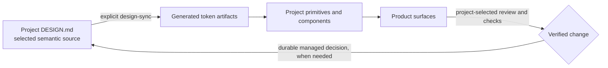

# design-readme · Optional Managed Design Toolkit

This is the operating manual for the devrules managed-design toolkit. It is not
an always-on UI standard and does not make `DESIGN.md`, `designmd`, generated
tokens, design hooks, scorecards, or a particular component stack mandatory for
repositories that contain devrules.

The overall Agent entry remains `always-readme.md`. Do not copy this document or
`rules/design-agent-rules.md` into `AGENTS.md`, `CLAUDE.md`, `WARP.md`, or another
Agent entry. Agent entries point to devrules; project design facts remain in the
project's selected source of truth.

## Activation Contract

Classify the target before following commands in this manual:

| Mode | Evidence | What applies |
| --- | --- | --- |
| `project_native` | Default when the project uses its own design docs, platform assets, components, scripts, or has not declared managed tooling. | Follow the project's existing system. This manual, `DESIGN.md`, `designmd`, `design:*` aliases, managed hooks, generated token files, changelog, and scorecards are `N/A`. |
| `devrules_managed` | Repository guidance/configuration explicitly adopts this toolkit, or an existing `DESIGN.md` plus its declared config/scripts is confirmed active. | Use only the managed artifacts and commands actually declared by that project. |
| `adoption_task` | The user explicitly asks to initialize, adopt, port, extract, or apply this managed system/style. | The selected adoption workflow may propose local artifacts within scope. Dependencies, hooks, CI changes, and broad UI migration remain separate decisions. |

The presence of `devrules/`, a template, or an unused script is not adoption. A
template update or project sync can make tooling available without activating it
for that project. When evidence is ambiguous, remain `project_native` and ask or
report the ambiguity only if it affects the requested work.

## What The Toolkit Provides When Selected

- An optional `DESIGN.md` format for semantic tokens plus design rationale.
- Local sync, check, lint, guard, inventory, and refactor-state scripts.
- Conditional design workflows for direction, component/page work, audits,
  refactors, and deliberate system adoption.
- An optional named style library with evidence extraction, validation, dry-run
  application, conflict protection, and explicit publication.
- Local hook and hosted-CI examples that a project may adopt through its own
  automation policy.

These are composable tools, not a required bundle. A project can select only the
pieces that fit its stack and mark the rest `N/A`.

## Decision And Source Boundaries

| Source | Owns | Does not own |
| --- | --- | --- |
| Project product/IA source | Capabilities, journeys, navigation, surfaces, product decisions, and ownership. | Visual values and technical modules. |
| Project-native design source | Existing asset catalogs, theme/style code, components, platform conventions, design docs, or linked design systems. | Product decisions outside its contract. |
| Managed `DESIGN.md` (only when adopted) | Selected semantic tokens, component semantics, interaction/design rationale, motion, and visual/accessibility guidance. | Product capabilities, navigation ownership, or technical architecture. |

The project remains the decision owner. Product/architecture review is selected
by actual risk; missing IDs, briefs, Design Reads, or devrules-specific paperwork
does not itself block a safe UI change.

## Optional Managed Pipeline

When a project explicitly adopts the complete generated-token path, its local
pipeline can be:



Running sync is explicit; generation is not a background side effect. The
project defines output paths, whether outputs are committed, which components
consume them, and which checks are blocking. Never hand-edit a confirmed
generated file.

## Directory Reference

```text
devrules/
├── design-readme.md               this opt-in manual
├── DESIGN.template.md             optional managed source template
├── DESIGN.example.md              illustrative managed design example
├── design.config.json             bundled tool configuration
├── design-guard.allow.json        optional guard exceptions with reasons
├── rules/
│   └── design-agent-rules.md      conditional shared design governance; not copied into Agent entries
├── design-styles/                 named style catalog and lintable style packs
├── workflows/
│   ├── design-read.md             risk-based direction review
│   ├── design-change.md           focused project-native or managed change
│   ├── design-new-component.md    component reuse/contract/implementation
│   ├── design-new-page.md         page/surface construction and verification
│   ├── design-audit.md            project-native or managed audit
│   ├── design-refactor-existing-project.md  risk-based incremental refactor
│   ├── design-init-new-project.md explicit managed initialization
│   ├── design-adopt-existing-project.md explicit existing-project adoption
│   ├── design-port-to-new-project.md explicit high-coupling port
│   ├── design-extract-style.md    explicit evidence-backed style extraction
│   └── design-apply-style.md      explicit dry-run-first style application
├── scripts/
│   ├── design-sync.mjs            managed source compiler and --check mode
│   ├── design-lint.mjs            managed source validation
│   ├── design-guard.mjs           optional source/content guard and inventory
│   ├── design-inventory.mjs       read-only UI inventory/debt scanner
│   ├── design-refactor-state.mjs  optional refactor-state validator
│   ├── design-style-library.mjs   extract/validate/publish/list/apply styles
│   └── design-selftest.mjs        shared-tooling regression suite
├── hooks/
│   ├── design-pre-commit.mjs      optional local managed check
│   ├── design-install-hooks.mjs   explicit local hook installer
│   └── ci/design-check.yml        hosted-CI reference; repository policy decides use
└── templates/                     optional briefs, specifications, reports, and examples
```

Templates are aids, not mandatory project artifacts. Project-native locations,
formats, and acceptance criteria take precedence.

## Routing

| Situation | Smallest route |
| --- | --- |
| Ordinary UI work in a project without managed adoption | Follow project-native guidance; optionally use the relevant design workflow as a checklist. Do not initialize this toolkit. |
| Materially open direction or broad redesign | `workflows/design-read.md` at a risk-proportionate depth. |
| Focused style, component, or page work | `design-change.md`, `design-new-component.md`, or `design-new-page.md`. These support project-native mode. |
| Requested audit or existing-UI refactor | `design-audit.md` or `design-refactor-existing-project.md`; managed artifacts remain optional. |
| Explicitly initialize managed tooling | `design-init-new-project.md`. |
| Explicitly migrate an existing project into managed tooling | `design-adopt-existing-project.md`. |
| Explicitly extract/apply/port a design system or style | The matching `design-extract-style.md`, `design-apply-style.md`, or `design-port-to-new-project.md`. |

`workflows/landing-page.md` and the product-architecture workflow activate from
their own product risk and task signals. This manual does not make them universal
prerequisites.

## Explicit Adoption Checklist

Before any local write, record:

1. who selected adoption and the requested scope;
2. the current project design authority and how duplication will be avoided;
3. the target stack, runtime, package/task runner, and generated-file policy;
4. which artifacts and commands are selected versus `N/A`;
5. representative UI and accessibility evidence needed to show behavior is
   preserved or intentionally changed.

Then follow `workflows/design-init-new-project.md` or
`workflows/design-adopt-existing-project.md`. Do not install dependencies, hooks,
or hosted workflows merely because the bundled scripts support them.

## Direct Script Commands

These commands are valid when the devrules instance exists at the shown path and
the project has selected the corresponding managed capability. Direct Node
commands avoid assuming a package manager alias:

```bash
node devrules/scripts/design-lint.mjs
node devrules/scripts/design-sync.mjs
node devrules/scripts/design-sync.mjs --check
node devrules/scripts/design-guard.mjs
node devrules/scripts/design-guard.mjs --inventory --format json
node devrules/scripts/design-inventory.mjs --root . --json
node devrules/scripts/design-refactor-state.mjs --state <state-file> --check-files --json
node devrules/scripts/design-style-library.mjs list
node devrules/scripts/design-selftest.mjs
```

If the repository explicitly declares package scripts such as `design:lint`,
`design:sync`, `design:check`, `design:guard`, or `design:audit`, use its actual
package manager and script names. Do not add aliases solely to satisfy this
manual.

## Tool Reference

| Tool | Purpose | Selected options and effects |
| --- | --- | --- |
| `design-sync.mjs` | Compile an adopted `DESIGN.md` into configured CSS/theme/DTCG outputs. | `--check` is read-only; without it the command writes configured outputs. `--design` and `--out` select paths. |
| `design-lint.mjs` | Validate an adopted managed source with bundled checks and optional official integration. | Local checks are the default; `--online` explicitly permits the package-on-demand CLI, `--offline` remains a compatibility alias for local-only execution, and `--format json` produces structured output. |
| `design-guard.mjs` | Scan selected source paths for configured literals, arbitrary values, fonts, and placeholder patterns. | `--staged`, `--inventory`, `--format json`, and `--strict`; severity and scope come from project config. |
| `design-inventory.mjs` | Inspect page/component/style evidence and design debt. | `--json` is read-only output; `--out <dir> --apply` writes the selected reports locally. |
| `design-refactor-state.mjs` | Validate an adopted refactor-state file. | `--state`, `--check-files`, and `--json`; the state file itself is optional. |
| `design-style-library.mjs` | Extract, validate, publish, list, and apply named style packs. | Write-capable subcommands are dry-run first and require `--apply`; inspect conflicts and publication scope before applying. |
| `design-install-hooks.mjs` | Install the local managed pre-commit integration. | Local write; run only after explicit project selection and review existing hook ownership. |
| `design-selftest.mjs` | Exercise shared managed-tool behavior and fixtures. | Intended for devrules/tool maintenance, not as a universal product check. |

## Named Style Operations

Use only inside an explicit extraction/application task:

```bash
# Read-only discovery and validation
node devrules/scripts/design-style-library.mjs list
node devrules/scripts/design-style-library.mjs validate --style <style-id>

# Extraction: first preview JSON, then write only to an approved review directory
node devrules/scripts/design-style-library.mjs extract \
  --source <repo-a> --source <repo-b> \
  --exclude <relative-surface> \
  --id <style-id> --name "<name>" --json
node devrules/scripts/design-style-library.mjs extract \
  --source <repo-a> --source <repo-b> \
  --exclude <relative-surface> \
  --id <style-id> --name "<name>" --out <review-dir> --apply

# Application: dry-run before local write
node devrules/scripts/design-style-library.mjs apply \
  --style <style-id> --repo <target> --json
node devrules/scripts/design-style-library.mjs apply \
  --style <style-id> --repo <target> --apply
```

Publishing a style is a separate shared/external-scope decision. Follow the
style workflow, review private/product identity boundaries, validate the pack,
and dry-run before any explicit publish apply.

## Guard Exceptions

An adopted guard can allow a legitimate brand, chart, third-party, generated, or
platform-specific value. Keep the exception in the project's chosen mechanism
and require a useful reason. The bundled allowlist shape is:

```jsonc
{
  "rule": "no-hex-color",
  "file": "src/components/brand/Logo.tsx",
  "match": "#FF5A00",
  "reason": "fixed licensed brand asset",
  "date": "2026-07-04"
}
```

The bundled inline form is:

```tsx
// design-guard-allow: no-hex-color -- fixed licensed brand asset
<path fill="#FF5A00" />
```

Projects using another lint/exception system should keep their native form.

## Writing A Managed DESIGN.md

When this format is deliberately selected:

1. Use concrete references and product evidence instead of adjective piles.
2. State semantic roles, usage boundaries, and meaningful negative constraints.
3. Put machine-readable values in tokens and durable reasons in prose.
4. Preserve authentic content, accessibility, target-platform behavior, and
   current product boundaries.

The format is a project-owned design source, not a mechanism for devrules to
choose the product's visual language.

## FAQ

**Does every repository with devrules need `DESIGN.md`?**

No. `project_native` is the default. Use the repository's existing design system
unless the project/user explicitly selects managed adoption.

**Can the official `designmd` CLI be used?**

Yes, when the project has deliberately selected that dependency and its package
execution policy permits it. On Windows, the `designmd` alias avoids `.md` file
association collisions. For an already approved package-on-demand invocation:

```bash
npx -p @google/design.md designmd lint DESIGN.md
```

Do not download or install it merely because this manual documents the command.
The bundled lint is local-only by default; use `--online` only after the project
or user explicitly selects the package-on-demand dependency and network access.

**What if the project already owns Git hooks?**

Do not replace them. Review the existing hook manager and integrate only if the
project explicitly selects the managed check. Running the installer is a local
write, not an implied setup step.

**Should generated design outputs be committed?**

Follow the repository's generated-file policy. If the adopted system commits
outputs, keep source and outputs in the same reviewed change and verify with
`design-sync.mjs --check`. Otherwise regenerate them through the declared build
path.

**How are dark mode, charts, third-party UI, or fixed brand colors handled?**

Use the project's existing theme and exception model. In the complete managed
format, `colors-dark` can generate a `.dark` scope and custom semantic groups can
represent charts. Legitimate non-token values can remain documented exceptions.

**Can a failing local design hook be skipped?**

Follow the project's hook and incident policy. If an authorized emergency bypass
is used, report the skipped evidence and run the equivalent check before claiming
success. A bypass must not turn an unknown failure into a passing result.
